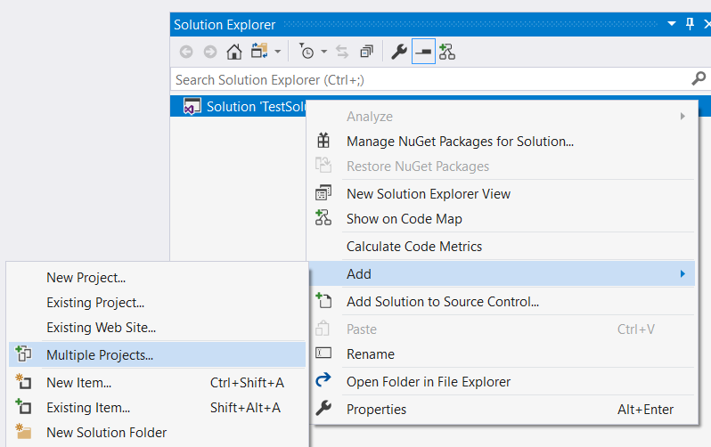
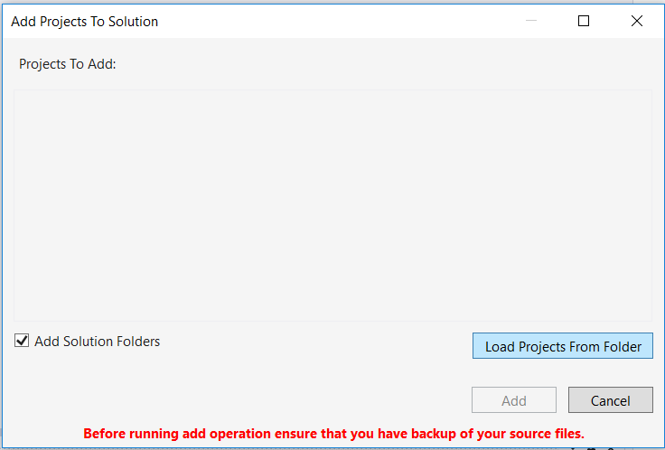
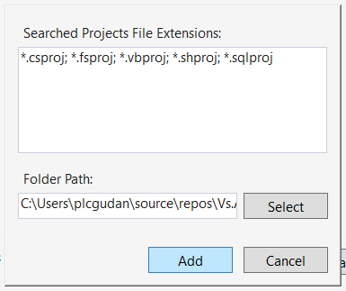
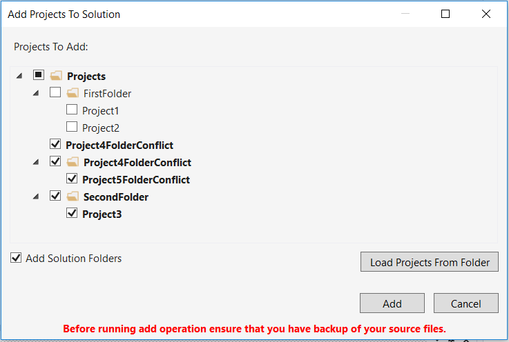
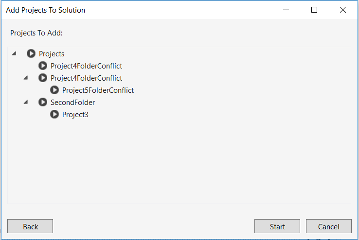
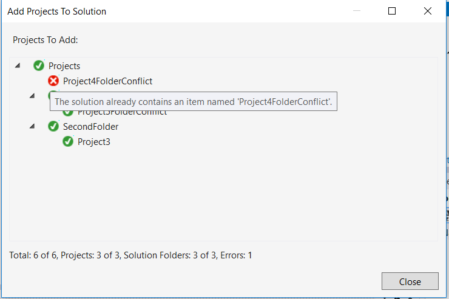
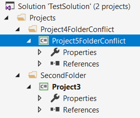

# Add Multiple Projects To Solution

<!-- Replace this badge with your own-->
<!-- PLACE FOR BUILD BADGE -->

<!-- Update the VS Gallery link after you upload the VSIX-->
<!--
Download this extension from the [VS Gallery](https://visualstudiogallery.msdn.microsoft.com/[GuidFromGallery])
or get the [CI build](http://vsixgallery.com/extension/2ed01419-2b11-4128-a2ca-0adfa0fc7498/).
-->

---------------------------------------

Visual Studio extension that allows adding multiple existing projects into 
the solution. Optionally creates the solution folder structure reflecting 
to the physical hierarchy on disk.

See the [change log](CHANGELOG.md) for changes and road map.

## Features

- Add mutliple projects to solution.
	- Load projects from given directory (recursive search by file extension).
    - Select which projects to add to the solution.
    - Define if solution folders hierarchy should be also created.

### Add multiple projects to solution
To add existing projects to the solution:
1. Right click the Solution node in Solution Explorer select Add -> Multiple Projects



2. Click Load Projects From Folder



3. Select directory and click Add



4. Found project will be displayed in the folder hierarchy in which they are defined on disk.
	- Select projects that you want to add to the solution. 
    - Define if solution folders should be created.
    - Click Add.



5. Review the structure of projects that will be created and press Start.



6. Check results. 

The state of the operation is indicated by the icon next to the project.
When you will hover with mause over the icon the details will be displayed.

On the bottom of the window total number of errors and processed projects is displayed.



7. The result of the operation.

If you want to add projects without solution folders check configuration in step 4.



## Known Issues
- [ ] The project references may be lost if project is added in not proper order.
```
GIVEN Project1 AND Project2 with reference to Project1
WHEN Project2 is added to solution first AND Project1 is added to solution second 
THEN Reference from Project2 to Project1 is lost AND Project2 is not building
```

## Contribute
Check out the [contribution guidelines](CONTRIBUTING.md)
if you want to contribute to this project.

For cloning and building this project yourself, make sure
to install the
[Extensibility Tools 2015](https://visualstudiogallery.msdn.microsoft.com/ab39a092-1343-46e2-b0f1-6a3f91155aa6)
extension for Visual Studio which enables some features
used by this project.

## License
[MIT License](LICENSE)